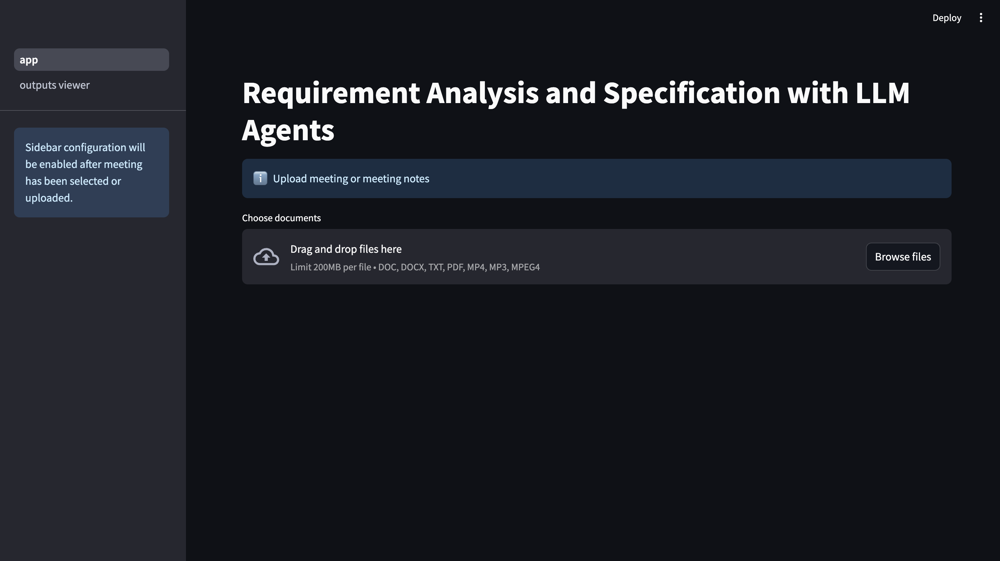

# Project Setup Instructions


## Prerequisites
- Python 3.10 or greater [Download Python](python.org/downloads)

## Clone the Repository
Clone the repository to a directory of your choosing:

- HTTPS:
```
git clone https://github.com/codebrain001/pycon-2024.git
```

- SSH:
```
git clone git@github.com:codebrain001/pycon-2024.git
```

- GitHub CLI:
```
gh repo clone codebrain001/pycon-2024
```

## Obtain API Keys
Get the following API keys for the project:

#### 1.  OpenAI API Key
- OpenAI models are the LLMs used for this project.
- Obtain your API key: [Where do I find my OpenAI API key?](https://help.openai.com/en/articles/4936850-where-do-i-find-my-openai-api-key)
- Note: Requires payment or use the test API with limited credit for demo purposes. 


#### 2. Serper Dev API Key
- For Google search functionality (first 2,500 search queries are free).
- Get your API key: [Get Serper Dev API key](https://serper.dev/api-key)

#### 3. Composio API Key
- Utilized for Composio tools in the project.
- Obtain your API key: [Get Composio API Key](https://docs.composio.dev/patterns/howtos/get_api_key)


#### 4. Perplexity AI API Key (Optional)
- Perplexity is a free AI-powered answer engine that provides accurate, trusted, and real-time answers to any question.
- For more advanced searching.
- It is paid to get and use its API.
- Get your API key: [Getting Started with Perplexity API](https://docs.perplexity.ai/guides/getting-started)

#### 5. Langtrace API Key
- Langtrace is an open-source, external tool that helps you set up observability and evaluations for Large Language Models (LLMs), LLM frameworks, and Vector Databases.
- Obtain your API key: [Langtrace Quickstart Guide]('https://docs.langtrace.ai/quickstart')


## Setup Virtual Environment
With the repository cloned on your system, access the pycon-2024 directory, which has the following structure:
```
.
├── LICENSE
├── README.md
├── req_engineering_project
├── requirements.txt
```

####  Create and activate a Python Virtual Environment
- macOS and Linux
```
python3 -m venv venv
source venv/bin/activate
```
- Windows
```
python -m venv venv
venv\Scripts\activate
```

#### Install Crewai packages

Install the packages listed in requirements.txt:
```
pip install -r requirements.txt
```

## Setup CrewAI Project
With the CrewAI packages successfully installed, navigate via the terminal to the req_engineering_project folder:
```
cd req_engineering_project
```

Directory structure:

```
.
├── README.md
├── poetry.lock
├── pyproject.toml
└── src
```

**Note**: When you create a new CrewAI project, it uses Poetry to handle packages and dependencies in a virtual environment more efficiently, avoiding dependency conflicts.


#### Install Packages with Poetry
Poetry is already installed when we installed the crewal packages. Next,  install the project dependencies using Poetry:

```
poetry install
```

## Configure API Keys
Upon completion, input your API keys in `src/req_engineering_project/tools/search_toolset.py`
```
import os

# Load environment variables
os.environ["SERPER_API_KEY"] = "your-serper-api-key"
os.environ["COMPOSIO_API_KEY"] = "your-composio-api-key"
```

Optional: Add Perplexity AI Integration
If you want to utilize the Perplexity AI search tool, add the integration connection to your account as follows:

```
composio add perplexityai
```

You will then be prompted to input your Perplexity AI API key during the setup process.

Update the Langtrace API key in `src/req_engineering_project/app.py`:
```
LANGTRACE_API_KEY = "your-langtrace-api-key"
```

***
***

**You're all set!** 

## Running the strealit application

You can run the streamlit application via:
```
streamlit run src/req_engineering_project/app.py   
```

For this project, we will be utilizing a simulated meeting about building an Emotion Surveillance Mobile Application, [Preview here](Meeting_Notes_001.pdf). Feel free to create a simulated meeting for a different use case to test the application.

**The Application Home UI is seen below**




## Workshop Highlights
- 🚀 Using the CrewAI latest workflow: crewai==0.60.0
- 🛠️ Utilizing tools from Langchain, LlamaIndex, Composio
- 📊 Sequential and Hierarchical process workflow
- 📝 Agent Planner for step-by-step plan before execution
- 🔍 Utilizing Langtrace for monitoring and observations of LLMs, LLM frameworks, and Vector Databases (Chroma DB)
- 🤖 Utilizing OpenAI models via APIs: GPT-4o, GPT-4o-Mini, and o1-Mini 
- 🦾 Running agents with same LLM or different LLMs (via LiteLLM)
